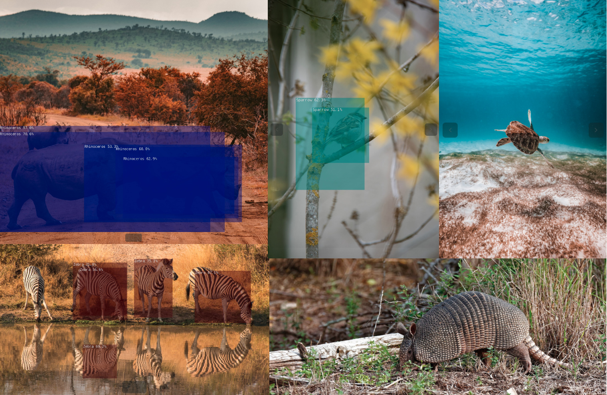

# W251 - Summmer 2021 - Homework 6
### Section 2: Alice Hua

This repository contains my homework 6 **Optimizing Models for the Edge and GStreamer** for course W251 - Deep Learning in the Cloud and at the Edge at the UC Berkeley School of Information.

### Common Files:

- `misc` is a directory of other files that were experimented on during the course of completing the assignment but were not used in the final turn in. These are kept here for reference to past attempts only.
- `client.py` is the python listener for the GStream part question 4.
- `ssd` is the folder directory from the jetson inference repo referred to  in the **References** section. Included here for reference on the changes made to this directory to complete part 2 of this assignment.

### Part I: GStreamer 
**Note**: you can use `jtop` to see Jetson hardware accelerators. NVDEC and NVENC are the GPU hardware accelerator engines for video decoding that support transcoding application.

1. Convert this pipeline to use the Nvidia nveglglesink.
```
# Nvidia sink nv3dsink
gst-launch-1.0 v4l2src device=/dev/video0 ! xvimagesink

# Nvidia sink nveglglessink
gst-launch-1.0 v4l2src device=/dev/video0 ! nvvidconv ! nvegltransform ! nveglglessink -e

# or
gst-launch-1.0 v4l2src device=/dev/video0 ! video/x-raw,framerate=30/1 ! nvvidconv ! nvegltransform ! nveglglessink -e 
``` 

2. Explain the difference between a property and a capability? How are they each expressed in a pipeline?
- A property is used to configure or to modify the behavior of an element, separated by spaces. A capacitity is describes the ypes of media that may stream over a pad, separated by commas (a pad is an element's interace to the outside world).

3. Explain the following pipeline, that is explain each piece of the pipeline, desribing if it is an element (if so, what type), property, or capability. What does this pipeline do?
```
gst-launch-1.0 v4l2src device=/dev/video0 ! video/x-raw, framerate=30/1 ! videoconvert ! agingtv scratch-lines=10 ! videoconvert ! xvimagesink sync=false
```

- This is opening the tool gst-launch-1.0 to run a pipeline from source element video4linux from a device location at /dev/video0 and ask for x-raw format with a frame rate of 30 fps then convert it to a format that can receive a special agingtv effect with property scratch-lines of 10 then convert it to a final format to send to sink element that gives us the video output without syncing on the clock.

4) GStreamer pipelines may also be used from Python and OpenCV. Write a Python application that listens for images streamed from a GStreamer pipeline.
Broadcaster/client GStreamer pipeline
```
gst-launch-1.0 v4l2src device=/dev/video0 ! video/x-raw,framerate=30/1,width=640,height=480  ! nvvidconv ! omxh265enc insert-vui=1 ! h265parse ! rtph265pay config-interval=1 ! udpsink host=192.168.1.143 port=5000 sync=false -e 
```
- Python source code: look at client.py

### Part 2: Model optimization and quantization
Similar to lab6 where we converted Keras saved model to TensorRT to look at 3 different quantization FP32, FP16 and INT8, this part of the excercise involves using the Jetson Inference Single Shot MultiBox Detector with Pytorch using MobileNet backbone and my selection of animal classes from Google Open Images dataset. Once the SSD-Mobilenet model is trained on the Xavier NX, I converted it to an ONNX format to run a TensorRT on test images. The original Pytorch uses 32FP whereas the TensorRT selected FP16.  

**Note**: If run on Docker container, make sure to raise the shared memory limit so that you can use higher batch size. You can do so with the command for JetPack version 4.4.1 or can be found at this [link](https://github.com/dusty-nv/jetson-inference/blob/master/docs/aux-docker.md)
```
docker run --gpus all -it --rm --shm-size=2048m dustynv/jetson-inference:r32.4.4
```
 

1) The base model used, trained using Jetson device and Jetson Inference scripts:
- mobilenet-v1-ssd-mp-0_675.pth

2) A description of your dataset 
Using the [Google Open Images Dataset](https://storage.googleapis.com/openimages/web/visualizer/index.html?set=train&type=segmentation), I chose seven classes of animals. The below command will download the dataset onto the running container:
```
python3 open_images_downloader.py --class-names "Rhinoceros,Sea turtle,Sparrow,Whale,Zebra,Blue jay,Armadillo" --data=data/animal
``` 
A total of 4300 images of 7 classes were downloaded. Below is the stats for the train/validation/test dataset
```
-------------------------------------
 'train' set statistics
-------------------------------------
  Image count:  3626
  Bounding box count:  5179
  Bounding box distribution: 
    Sparrow:  1387/5179 = 0.27
    Zebra:  993/5179 = 0.19
    Sea turtle:  958/5179 = 0.18
    Whale:  912/5179 = 0.18
    Rhinoceros:  659/5179 = 0.13
    Blue jay:  232/5179 = 0.04
    Armadillo:  38/5179 = 0.01
 

-------------------------------------
 'validation' set statistics
-------------------------------------
  Image count:  171
  Bounding box count:  220
  Bounding box distribution: 
    Sparrow:  63/220 = 0.29
    Zebra:  41/220 = 0.19
    Whale:  41/220 = 0.19
    Sea turtle:  33/220 = 0.15
    Rhinoceros:  21/220 = 0.10
    Blue jay:  21/220 = 0.10
 

-------------------------------------
 'test' set statistics
-------------------------------------
  Image count:  505
  Bounding box count:  675
  Bounding box distribution: 
    Sparrow:  159/675 = 0.24
    Sea turtle:  152/675 = 0.23
    Whale:  124/675 = 0.18
    Zebra:  111/675 = 0.16
    Rhinoceros:  69/675 = 0.10
    Blue jay:  60/675 = 0.09
 

-------------------------------------
 Overall statistics
-------------------------------------
  Image count:  4302
  Bounding box count:  6074

```

 
3) How long did it take to train model, how many epochs and batch-size?  

|           | Time trained model | batch-size | number of epochs |
|-----------|--------------------|------------|------------------|
| Xavier NX | ~6 hrs             | 10         | 30               |   

Below are some of the images output of this model. Some were not classified at all while some did.


4 & 5) Native Pytorch baseline & TensorRT performance numbers

For reference, the Pytorch model uses FP32, and TensorRT uses FP16. So, we have quantization in this optimized model.
```
[TRT]    detected model format - ONNX  (extension '.onnx')
[TRT]    desired precision specified for GPU: FASTEST
[TRT]    requested fasted precision for device GPU without providing valid calibrator, disabling INT8
[TRT]    native precisions detected for GPU:  FP32, FP16, INT8
[TRT]    selecting fastest native precision for GPU:  FP16
[TRT]    attempting to open engine cache file models/animal/ssd-mobilenet.onnx.1.1.7103.GPU.FP16.engine
[TRT]    loading network plan from engine cache... models/animal/ssd-mobilenet.onnx.1.1.7103.GPU.FP16.engine
[TRT]    device GPU, loaded models/animal/ssd-mobilenet.onnx
```
The following are model performance for both models, measured in terms of images/sec on the test set.

|                | Native Pytorch     | TensorRT           |
|----------------|--------------------|--------------------|
| Inference time | ~13-14 images/sec  | ~17-18 images/sec  |


```
# Native Pytorch 
python3 valid_ssd.py --data=data/animal --model-dir=models/animal --resume=models/animal/mb1-ssd-Epoch-29-Loss-8.494942945592543.pth --batch-size=1 --epoch=1
505it [00:36, 13.70it/s]
# So this means 13 images/sec after a run on 505 images  

# TensorRT
IMAGES=/jetson-inference/python/training/detection/ssd/data/animal/test   
detectnet.py --model=models/animal/ssd-mobilenet.onnx --labels=models/animal/labels.txt \
          --input-blob=input_0 --output-cvg=scores --output-bbox=boxes \
            "$IMAGES/*.jpg" $IMAGES/test/%i.jpg
Total img:  505
Total time: 27.021751642227173
Images per second:  18.68864782292023
```

### References:
- For GStreamer:
	- https://docs.nvidia.com/metropolis/deepstream/DeepStream_5.0.1_Release_Notes.pdf
	- https://forums.developer.nvidia.com/t/how-to-stream-frames-using-gstreamer-with-opencv-in-python/121036/3
	- https://docs.nvidia.com/jetson/l4t/index.html#page/Tegra%20Linux%20Driver%20Package%20Development%20Guide/accelerated_gstreamer.html
	- https://medium.com/@fanzongshaoxing/use-nvidia-deepstream-to-accelerate-h-264-video-stream-decoding-8f0fec764778
- For Jetson Inference & Optimization
	- https://github.com/dusty-nv/jetson-inference
	- https://github.com/dusty-nv/jetson-inference/blob/master/docs/pytorch-ssd.md
	- https://github.com/dusty-nv/pytorch-ssd/blob/master/open_images_classes.txt
	- https://storage.googleapis.com/openimages/web/download.html
	- https://github.com/qfgaohao/pytorch-ssd
	- https://docs.nvidia.com/deeplearning/frameworks/tf-trt-user-guide/index.html
	 
